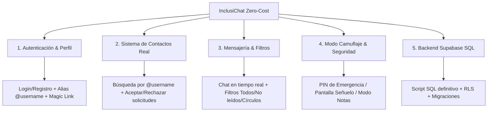

# Plan de Transformación y Finalización Funcional: InclusiChat Zero-Cost

Este documento define la hoja de ruta técnica y de producto para transformar **InclusiChat** en una aplicación de mensajería privada, inclusiva y 100% funcional, operando bajo un modelo de **coste cero ($0/mes)** y con funcionalidades únicas de alto valor (*Camuflaje*, *Círculos de Confianza*, *Contactos por Username* y *Accesibilidad Universal*).

---

## 1. Decisiones Clave del Producto

* **Pivote del Modelo de Descubrimiento (Sin coste de SMS OTP):**  
  Sustituiremos la obligación del SMS OTP por un sistema de **identidad mediante Alias único (@username) y correo/Magic Link**. Esto protege la privacidad de tu público (no expone sus números de teléfono) y ahorra el 100% de los costes de verificación.
* **Base de Datos y Backend (Supabase Free Tier):**  
  Generaremos el archivo `supabase_schema.sql` con todas las tablas (`profiles`, `contacts`, `contact_requests`, `conversations`, `conversation_participants`, `messages`, `message_receipts`), funciones RPC seguras y políticas RLS (*Row Level Security*) para que puedas ejecutarlo directamente en el SQL Editor de Supabase.

---

## 2. Diagrama de Arquitectura

---

## 3. Cambios Propuestos por Módulo

### 1. Base de Datos y Backend (Supabase Setup)
* **`app/supabase_schema.sql`** (NUEVO):
  * Definición de tablas con Row Level Security (RLS).
  * Tablas: `profiles`, `contacts`, `contact_requests`, `conversations`, `conversation_participants`, `messages`, `message_receipts`.
  * Funciones RPC:
    * `create_direct_conversation(other_user_id)`
    * `send_contact_request(target_username)`
    * `accept_contact_request(request_id)`
    * `reject_contact_request(request_id)`
    * `search_profiles(query_text)`

### 2. Autenticación, Identidad y Perfil
* **`app/lib/src/features/auth/data/auth_service.dart`** (MODIFICAR):
  * Registro con asignación de `@username` único.
  * Soporte para inicio de sesión por correo / contraseña y Magic Links.
* **`app/lib/src/features/auth/presentation/register_page.dart`** (MODIFICAR):
  * Agregar campo de `@username` (alias seguro para ser encontrado sin revelar nombre real ni teléfono).
* **`app/lib/src/features/auth/presentation/login_page.dart`** (MODIFICAR):
  * Validación accesible y clara de credenciales.

### 3. Sistema de Contactos y Círculos de Confianza
* **`app/lib/src/features/chat/data/chat_service.dart`** (MODIFICAR):
  * Métodos para buscar por `@username`, enviar/aceptar solicitudes de amistad y listar contactos.
* **`app/lib/src/features/chat/presentation/contacts_page.dart`** (NUEVO):
  * Vista para la pestaña "Contactos" (solicitudes pendientes, lista de contactos y botón para agregar).
* **`app/lib/src/features/chat/presentation/add_contact_dialog.dart`** (NUEVO):
  * Modal para buscar personas por `@username` e invitarlas a conectar.

### 4. Mensajería, Filtros y Ajustes
* **`app/lib/src/features/chat/presentation/chat_home_page.dart`** (MODIFICAR):
  * Conectar pestaña Contactos y barra de filtros (*Todas*, *Por leer*, *Destacadas*, *Círculos*, *Colectivos*).
* **`app/lib/src/features/chat/presentation/conversation_page.dart`** (MODIFICAR):
  * Confirmaciones de lectura fucsia/moradas en tiempo real y soporte para mensajes.

### 5. Killer Feature: Bóveda y Modo Camuflaje
* **`app/lib/src/features/security/data/camouflage_service.dart`** (NUEVO):
  * Control local de activación del modo camuflaje y PIN secreto de desbloqueo.
* **`app/lib/src/features/security/presentation/camouflage_page.dart`** (NUEVO):
  * Pantalla señuelo ("Bloc de Notas" o "Calculadora") que oculta los chats reales ante miradas no autorizadas hasta escribir el PIN secreto.
* **`app/lib/src/features/chat/presentation/profile_settings_page.dart`** (NUEVO):
  * Pantalla de edición de perfil e identidad (nombre, `@username`, pronombres y avatar).

---

## 4. Plan de Verificación
1. **Verificación Estática y Pruebas:** Ejecución de `flutter analyze` y `flutter test`.
2. **Pruebas de Flujo Completo:** Registro con `@username` -> Búsqueda de contacto -> Envío y aceptación de solicitud -> Chat en tiempo real -> Activación del Modo Camuflaje.
